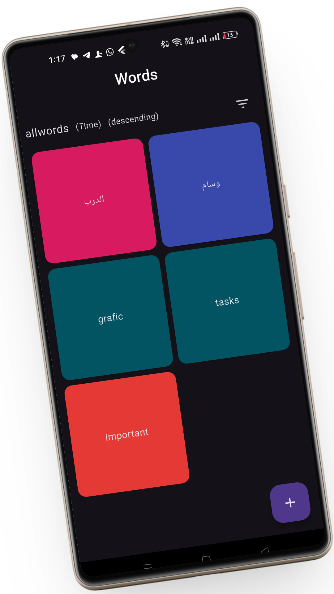
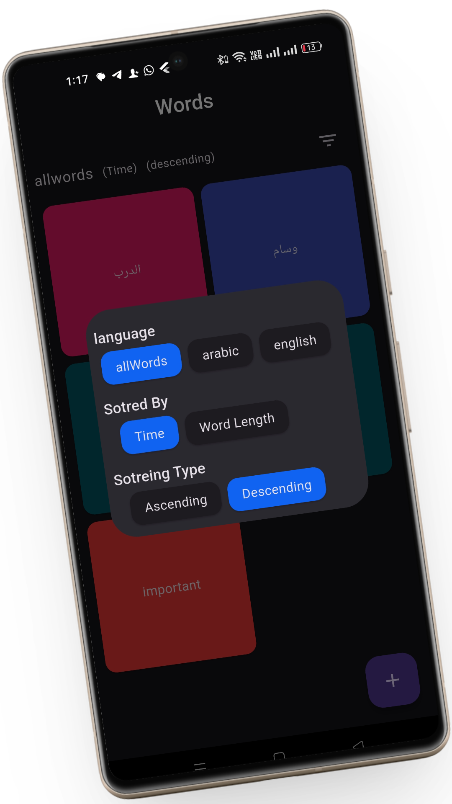
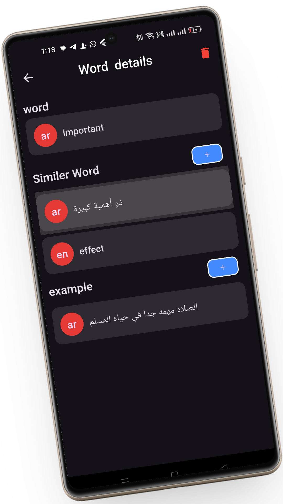
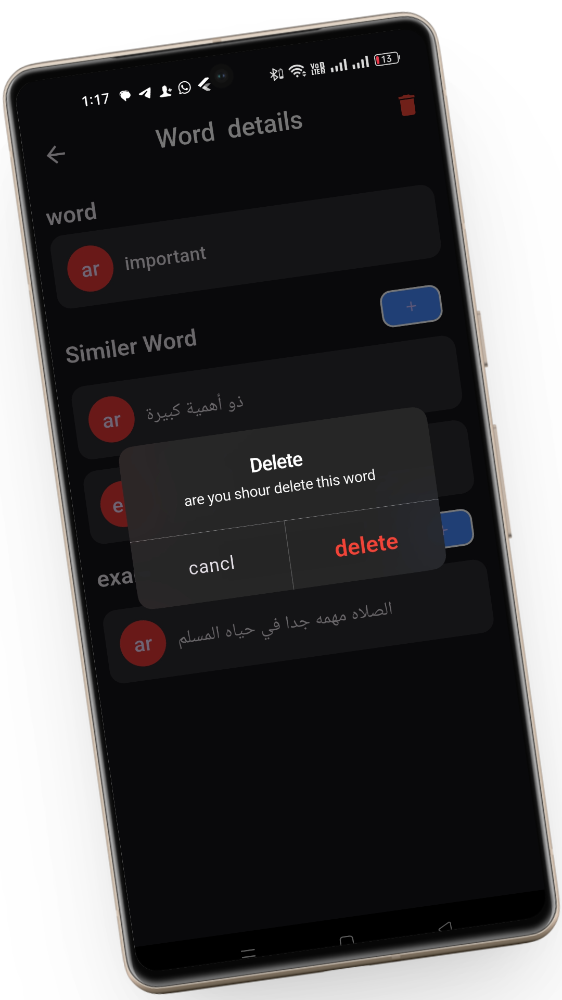

# 📖 Local Dictionary App

A **local dictionary application** built with `Flutter` that provides **words, meanings, and examples** with a **powerful filtering and sorting system**.  
Designed using **Cubit + MVC architecture** with **Hive local database** for fast and offline access.

---

## 📌 Table of Contents
- [Screenshots](#-screenshots)  
- [Features](#-features)  
- [Tech Stack](#-tech-stack)  
- [Architecture](#-architecture)  
- [State Management](#-state-management)  
- [Local Database](#-local-database)  
- [Filtering & Sorting](#-filtering--sorting)  
- [Performance](#-performance)  
- [License](#-license)  

---

## 📸 Screenshots

<table>
<tr> 
  <td></td>
  <td></td> 
  <td></td> 
  <td></td>
</tr>
</table>

---

## 🚀 Features
- 📚 **Words Dictionary** – View words with meanings and examples  
- 🧠 **Examples Support** – Each word includes usage examples  
- 🔍 **Advanced Filtering** – Filter words by category, letters, or custom rules  
- 📊 **Smart Sorting** – Sort alphabetically or by custom logic  
- 💾 **Offline Access** – Fully local app using Hive  
- 🏗 **Clean Structure** – MVC architecture with Cubit state management  
- ⚡ **Fast Performance** – Instant search & navigation  

---

## 🛠 Tech Stack
- **Flutter**  
- **Dart**  
- **Hive** (Local Database)  
- **Cubit** (State Management)  
- **MVC Architecture**  

---

## 🏛 Architecture
This project follows **MVC (Model–View–Controller)** architecture:
- Clear separation of concerns  
- Easy to maintain and extend  
- Scalable structure for future features  

---

## 🧠 State Management
- **Cubit** for handling UI state  
- Manages:
  - Loading states  
  - Filtering & sorting states  
  - Data updates from Hive  

---

## 💾 Local Database
- **Hive** is used for local storage  
- Fast read/write operations  
- Persistent offline data  
- Lightweight and optimized for mobile  

---

## 🔍 Filtering & Sorting
- Advanced and flexible filtering system  
- Alphabetical sorting  
- Custom sorting logic  
- Optimized for large word lists  

---

## ⚡ Performance Boosters
- Cached local data  
- Optimized list rendering  
- Smooth scrolling  
- Minimal memory usage  

---

## 📄 License
This project is licensed under the MIT License - see the LICENSE file for details.
